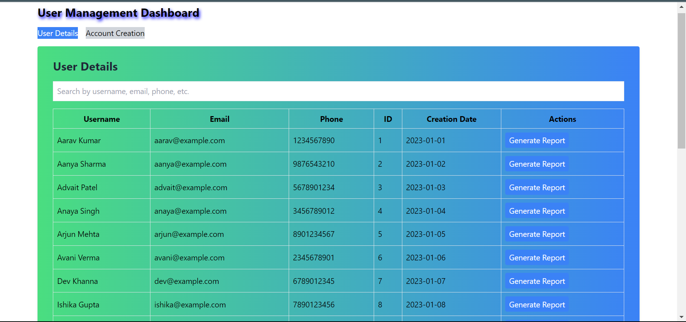

# User Management Dashboard

Live Hosted Link: https://userdetailsdashboard.netlify.app/

## Implement a searchable table displaying user information: Username, Email,
Phone, ID, and Creation date.

## Enable a click action on any user in the search results to open a popup/modal with
a button to generate a report for the selected user.

## Create a form with fields for username and password.

## Available Scripts

In the project directory, you can run:

### `npm start`

Runs the app in the development mode.\
Open [http://localhost:3000](http://localhost:3000) to view it in your browser.

